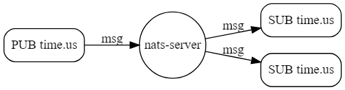

# NATS基本使用
## 环境安装
### nats-server
推荐使用docker进行安装
```
docker pull nats:latest
```
nats默认通信端口为4222,使用`docker run`构建容器
```
docker run -it -d -p 4222:4222 --name nats_local nats:latest
```
使用go测试连接nats:

```go
package main

import (
	"fmt"
	"log"
	"github.com/nats-io/nats.go"
)

func main() {
	_, err := nats.Connect
	if err != nil {
		log.Fatalf("连接nats服务器失败:%v\n",err)
	}
	fmt.Println("连接成功")
}
```
### natscli
nats-server一般需要natscli进行配合，natscli可通过 https://github.com/nats-io/natscli 安装。如没有win版本可克隆项目后进入nats目录使用`go build`自行编译后将可执行文件重命名为nats加入环境变量即可,其他nats工具可使用同样方法进行安装。 
通过`nats --version`验证natscli是否安装成功。


natscli安装在本机并不是在docker容器内，如果容器开启权限验证natscli进行连接时同样需要验证。

## 消息机制
nats消息机制为基于主题的生产者消费者模型。

  
nats通过subject发布消息为消息打上标记，如图中的`time.us`,可以通过`.`来定义一个有层级的subject。
```
time.us
time.us.east
time.us.east.newyork
time.cn
time.cn.beijing
```
Nats为subject提供了两种通配符，订阅者可通过通配符订阅多个主题的消息(subject用法会在代码中展示)。  
1. `*`会匹配单个字符串:
    * 可在同一个subject中多次出现
    * 如`time.*.east`可匹配`time.us.east`或`time.eu.east`但不可匹配`time.us.east.newyork`  
2. `>`会匹配多个字符串:
    * 只能在同一个subject中出现一次
    * 如`time.us.>`可匹配`time.us.east`和`time.us.east.newyork`等。
### publish-subscribe模式
基本的发布订阅模式,会通过主题将消息广播至所有的订阅者。

```go
	nc, _ := nats.Connect(nats.DefaultURL)
	// 发布者 "foo"即为主题
	nc.Publish("foo", []byte("Hello World"))
	// 异步订阅者
	nc.Subscribe("foo", func(m *nats.Msg) {
            fmt.Printf("Received a message: %s\n", string(m.Data))
        }
```
有更多用法可参考https://github.com/nats-io/nats.go 
### request-reply模式
在此模式下发布者发送一个请求后，程序可阻塞等待响应或者异步的等待响应。  
  
```go
// 请求 等待10毫秒
msg, err := nc.Request("help", []byte("help me"), 10*time.Millisecond)
// 响应 收到消息后回复
nc.Subscribe("help", func(m *nats.Msg) {
    nc.Publish(m.Reply, []byte("I can help!"))
})
```
### Queue Groups模式
此模式下nats服务器会随机的将消息分配至订阅者，而不是广播出去。
  
```go
// 将消息随机分配至 "foo"和"job_workers"中不在队列组中的订阅者依然会接收到所有消息。
nc.QueueSubscribe("foo", "job_workers", func(_ *Msg) {
  received += 1;
})
```

## JetStream持久化
nats的持久化策略streaming已经弃用，官方提供了最新的解决方案JetStream，nats通过创建一个stream来保存消息流，再通过以上三种模式发送给不同的消费者。  

通过`nats-server -js`启动jetstream服务器。

也可以通过使用配置文件来启动jetstream服务器，在nats安装目录下找到`nats-server.conf`并添加
```
jetstream:enable
jetstream {
    store_dir: /nats/jetstream
    max_file_store:10737418240
}
```
其中store_dir为使用文件存储时的存储路径。max_file_store为最大存储容量，达到该容量时可选择舍弃旧数据或者不再存取新数据。

### 创建stream
```go
nc,_ := nats.Connect(nats.DefaultURL)
js,_ := nc.JetStream()

js.AddStream(&nats.StreamConfig{
	Name: "SERVER",
	Subjects: []string{"SERVER.*"},
})

// Simple Async Stream Publisher
for i := 0; i < 500; i++ {
js.PublishAsync("SERVER.scratch", []byte("hello"))
}
select {
case <-js.PublishAsyncComplete():
case <-time.After(5 * time.Second):
fmt.Println("Did not resolve in time")
}
```
创建完成后可通过natscli查看stream信息，在命令行输入`nats stream view SERVER`。


### 创建消费者
```go
// 创建消费者
js.AddConsumer("ORDERS", &nats.ConsumerConfig{
	Durable: "MONITOR",
})
sub, err := js.PullSubscribe("ORDERS.*", "MONITOR")
// 分批从stream拉取消息一次10个
msgs, err := sub.Fetch(10)
for _,msg := range msgs {
	fmt.Println(string(msg))
}
```
### 删除Stream和消费者
```go
// 删除消费者
js.DeleteConsumer("ORDERS", "MONITOR")

// 删除Stream
js.DeleteStream("ORDERS")
```
### 权限验证
nats提供多种验证方式这里只演示nkey方法验证，在配置文件中添加用户来开启权限验证。使用nk工具生成密钥对`nl -gen user -pubout`,S开头的为种子私钥需妥善保管,U开头的为公钥需要写进配置文件中。
```
SUAKFJWTZINESBNJTSCVD3M6DMEEC5DCJ6253WX3KY2GCNTDYKR2ZBHIBE
UC5CDEDJYPOGIYG2BNSRJ6AL75HOPEXYIDGH2EHDT2I4VF6ZYLEWRYM4
```

#### 添加用户
打开配置文件添加用户并分配权限，`permissions`为权限类型可通过`$`符进行分割采用名为SERVER的权限方案。  
* `>`表示为全部权限可在任何主题中订阅或发布消息
* WEB用户只可在`ORDER`主题中订阅或发布消息
```
authorization {
  SERVER = {
    publish = ">"
    subscribe = ">"
  }
  WEB {
    publish = "ORDER.PUB"
    subscribe = "ORDER.SUB"
  }
  users: [
    {
    	nkey: UC5CDEDJYPOGIYG2BNSRJ6AL75HOPEXYIDGH2EHDT2I4VF6ZYLEWRYM4,
    	permissions: $SERVER
    }
    {
    	nkey: UC5CDEDJYPOGIYG2BNSRJ6AL75HOPEXYIDGH2EHDT2I4VF6ZYLEWRYM4,
    	permissions: $WEB
    }
  ]
}
```
#### 身份验证
需要事先将私钥保存在文件中(可用多种形式存储,此处采用txt)以读取认证。
```go
nkey, _ := nats.NkeyOptionFromSeed("nkey/nats.txt")
nc,err := nats.Connect(nats.DefaultURL,nats.NoEcho(),nkey)
if err != nil {
	log.Fatalf("权限验证失败:%v\n",err)
}
```
